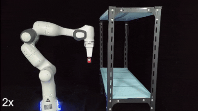

# Multi-layered Safety of Redundant Robot Manipulators via Task-oriented Planning and Control

This repository contains the source code for the implementation of *multi-layered safety in robot manipulators*. This work has been accepted for presentation at the 2025 IEEE International Conference on Robotics and Automation (ICRA). You can find the full text [here](https://arxiv.org/abs/2410.17742). Code is on the way!


<div align="center">



</div>

From left to right: static obstacles, dynamic obtacles, and unknown contacts


# Citation
If you find this repository useful, please cite:
```
@INPROCEEDINGS{arm_safety_2025,
    author={Jia, Xinyu and Wang, Wenxin and Yang, Jun and Pan, Yongping and Yu, Haoyong},
    booktitle={2025 IEEE International Conference on Robotics and Automation (ICRA)},
    title={Multi-layered Safety of Redundant Robot Manipulators via Task-oriented Planning and Control},
    year={2025}}
```
